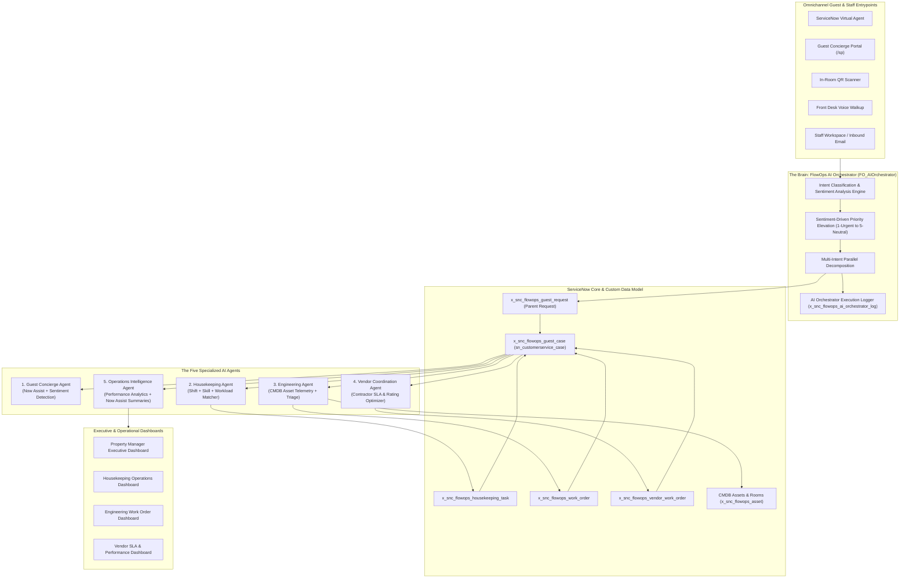
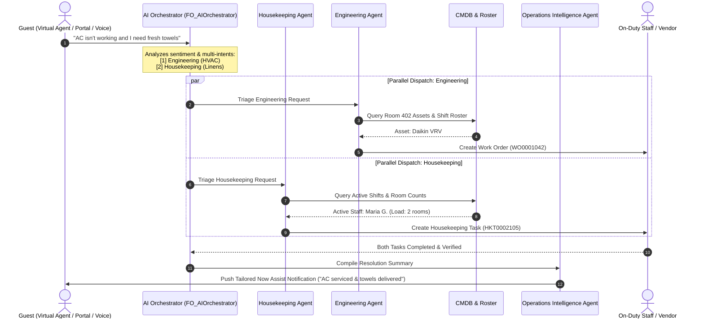
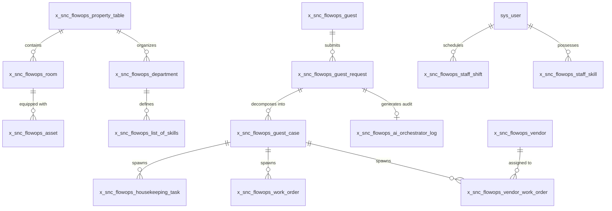

# FlowOps AI — Autonomous Multi-Agent Hotel Operations Platform

<div align="center">

[](https://developer.servicenow.com/)
[](https://developer.servicenow.com/)
[](https://www.servicenow.com/now-platform/generative-ai.html)
[](https://drive.google.com/file/d/1t5P0lIekwRaRHrJyTYCY6QnYoGJSLrC1/view?usp=drive_link)
[](#team-structure--hackathon-roles)

<br/>

**A next-generation hotel operations ecosystem powered by autonomous AI agents, multi-intent workflow decomposition, dynamic staff shift routing, and real-time cross-property operational intelligence.**

[**Watch Hackathon Video Submission**](https://drive.google.com/file/d/1t5P0lIekwRaRHrJyTYCY6QnYoGJSLrC1/view?usp=drive_link) • [**Architecture**](#architecture-overview) • [**The 5 AI Agents**](#the-five-specialized-ai-agents) • [**Data Model**](#data-model--schema) • [**Workflows**](#example-workflows-in-action) • [**Setup Guide**](#installation--configuration)

</div>

---

## Executive Overview

Managing a luxury hotel portfolio spanning **35 five-star hotels across 20 countries** (averaging **450 rooms per property**) requires orchestration of hundreds of daily guest requests, housekeeping cycles, engineering tasks, and external contractor SLAs.

### The Operational Challenge
In traditional hotel management:
* **Fragmented Channels:** Front Desk, Housekeeping, Engineering, and Vendors communicate via isolated radios, phone calls, paper logs, and disjointed software.
* **Single-Ticket Bottlenecks:** A guest message like *"My room AC is leaking and I need 2 fresh towels"* gets logged as a single generic ticket, resulting in delay or one department waiting on another.
* **Static Staffing & Shift Disconnect:** Work orders get assigned to off-duty or overbooked technicians without visibility into active shifts or real-time room queues.
* **Blindspot Facilities Maintenance:** Equipment failures are handled reactively rather than referencing CMDB asset history, warranty states, or planned maintenance cycles.
* **Delayed Managerial Intelligence:** General Managers only see historical shift reports rather than real-time SLA breach risks across properties.

### The FlowOps AI Solution
**FlowOps AI** resolves these friction points by deploying an **autonomous multi-agent architecture** natively on the ServiceNow platform (`x_snc_flowops`):
1. **Intelligently extracts and separates multi-intent requests** into concurrent departmental workflows.
2. **Dynamically assigns tasks** based on live staff shifts, verified skills, and active room loads.
3. **Automates engineering triage** with CMDB room equipment records and contractor SLA dispatching.
4. **Empowers leadership** with real-time Performance Analytics and AI-generated operational summaries.

---

## Why FlowOps AI is Better

| Traditional Hotel Operations | FlowOps AI Platform |
| :--- | :--- |
| **Department Silos:** Teams automate independently with minimal shared context. | **Multi-Agent Collaboration:** 5 specialized AI agents work collaboratively through a unified Orchestrator. |
| **Single-Ticket Logjam:** One compound guest request creates one generic ticket. | **Multi-Intent Parallel Decomposition:** One message triggers synchronized, simultaneous workflows. |
| **Manual Dispatching:** Supervisors manually page staff and coordinate vendors via phone. | **Skill & Shift-Aware Routing:** Automatic allocation based on active roster, skill category, and current workload. |
| **Reactive Maintenance:** Assets run to failure; history is siloed in legacy logs. | **CMDB Asset Intelligence:** Triage integrates maintenance history, equipment criticality, and warranty status. |
| **Delayed Shift Reports:** Management reviews issues hours after the guest checks out. | **Now Assist Operations Intelligence:** Real-time SLA breach alerts, sentiment tracking, and executive dashboards. |
| **No Central Visibility:** Each property is an isolated operational island. | **Multi-Property Governance:** Unified dashboards across all 35 international properties. |

---

## Architecture Overview

FlowOps AI combines ServiceNow **App Engine Studio**, **AI Agent Studio**, **Flow Designer**, **Decision Tables**, **Customer Service Management (CSM)**, **CMDB**, and **Now Assist** into a multi-layered orchestration stack.



---

## The AI Orchestrator & Parallel Decomposition

The core Script Include `FO_AIOrchestrator` (`x_snc_flowops.FO_AIOrchestrator`) acts as the central brain of the platform:

1. **Intent Classification & Sentiment Scoring:**
   The guest's raw input is analyzed against the hotel's department skill catalog (`x_snc_flowops_list_of_skills`). The engine detects:
   * **Sentiment:** `1-Urgent & Distressed`, `2-Sarcastic`, `3-Aggressive`, `4-Frustrated`, `5-Neutral`.
   * **Priority Derivation:** Negative sentiments (e.g. urgent distress or frustration) automatically elevate the ticket priority to `1-Critical` or `2-High`.
2. **Parallel Decomposition:**
   If a guest submits:
   > *"The air conditioning in room 402 is blowing warm air and making noise, and we also need extra bath towels and toiletries."*
   The Orchestrator splits this single submission into:
   * **Engineering Guest Case:** Dispatches an HVAC diagnostic work order, checks Room 402 AC asset records in CMDB, and schedules an on-shift HVAC engineer.
   * **Housekeeping Guest Case:** Dispatches a linen delivery task, locates an on-shift housekeeper on the 4th floor with minimal room load, and assigns the task.
3. **Two-Way Status Rollup:**
   Business rules track child work orders (`x_snc_flowops_work_order`, `x_snc_flowops_housekeeping_task`, `x_snc_flowops_vendor_work_order`). When all child cases resolve, the parent `x_snc_flowops_guest_request` is automatically marked **Resolved**, and Now Assist generates a personalized notification to the guest.



---

## The Five Specialized AI Agents

### 1. Guest Concierge Agent
* **Purpose:** Serves as the primary 24/7 conversational touchpoint for guests across all properties.
* **Core Responsibilities:** Understand natural language, extract room context, detect guest emotion and sentiment, classify request urgency, answer FAQs from Knowledge Base (`kb_knowledge`), and open tracked requests.
* **Key ServiceNow Technologies:** Virtual Agent, Now Assist for Customer Service, Service Portal widgets (`guest_ai_chat`, `Guest Voice Walkup`).

### 2. Housekeeping Agent
* **Purpose:** Automates daily room assignments, urgent guest amenity requests, and turnaround tasks.
* **Core Responsibilities:**
  * Checks live shifts (`x_snc_flowops_staff_shift`) using `isTimeWithinShift()` to eliminate dispatching to off-duty staff.
  * Validates staff capabilities against required skill categories (`x_snc_flowops_staff_skill`).
  * Balances floor workload by evaluating active assigned room counts (`current_room_count`).
* **Key ServiceNow Technologies:** AI Agent Studio, Flow Designer, Decision Tables.

### 3. Engineering Agent
* **Purpose:** Handles facilities maintenance, room asset failures, and preventive upkeep.
* **Core Responsibilities:**
  * Queries CMDB (`x_snc_flowops_asset`) linked to the specific room to inspect asset age, criticality, and previous service history.
  * Automatically decides between **internal engineering dispatch** and **external vendor dispatch** (`EngineeringTriage`).
  * Suggests preventive maintenance schedules to prevent cascading equipment failures.
* **Key ServiceNow Technologies:** CMDB, Planned Maintenance, Flow Designer, Integration Hub.

### 4. Vendor Coordination Agent
* **Purpose:** Manages external third-party contractors for specialized repairs (elevators, commercial boilers, HVAC chillers, kitchen refrigeration).
* **Core Responsibilities:**
  * Filters approved vendors (`x_snc_flowops_vendor`) by service category and serviced property.
  * Selects contractors based on historical rating, agreed SLA response time (hours), and contract status.
  * Generates and tracks `x_snc_flowops_vendor_work_order` with automated escalation workflows.
* **Key ServiceNow Technologies:** Vendor Management, Integration Hub REST APIs, Flow Designer.

### 5. Operations Intelligence Agent
* **Purpose:** Provides executive decision support and cross-property operational visibility to General Managers and Regional Directors.
* **Core Responsibilities:**
  * Analyzes live SLA adherence, highlights breach risks before they occur, and identifies recurring equipment failure patterns.
  * Synthesizes property performance KPI snapshots (`x_snc_flowops_property_kpi_snapshot`).
  * Drafts natural language morning briefing reports using Now Assist GenAI summarization.
* **Key ServiceNow Technologies:** Performance Analytics, Now Assist, AI Search, Executive Dashboards.

---

## Data Model & Schema

The application is built within the scoped namespace `x_snc_flowops` across **25 custom and extended tables**:



### Key Tables Catalog

| Table Name | Label | Extends | Description |
| :--- | :--- | :--- | :--- |
| `x_snc_flowops_guest_request` | Guest Request | Base | Top-level intake record capturing raw text, channel, guest, property, sentiment score, and detected intents. |
| `x_snc_flowops_guest_case` | Guest Case | `sn_customerservice_case` | Departmental case extending native ServiceNow CSM. Tracks SLAs, assignment types (Internal vs. Vendor), and resolutions. |
| `x_snc_flowops_housekeeping_task` | Housekeeping Task | Base | Operational task for room cleaning, linen replenishment, and inspections with assigned staff and due times. |
| `x_snc_flowops_work_order` | Work Order | Base | Internal engineering repair ticket linked directly to room assets, root causes, and engineer resolution notes. |
| `x_snc_flowops_vendor_work_order` | Vendor Work Order | Base | Contractor work order tracking contracted response times, cost, performance ratings, and vendor confirmations. |
| `x_snc_flowops_ai_orchestrator_log` | AI Orchestrator Log | Base | Audit log recording execution time (ms), detected intents, agents invoked, and decision summaries. |
| `x_snc_flowops_asset` | Hotel Asset | Base | Room and facility equipment (HVAC, minibar, TV, plumbing) with warranty dates, criticality, and service logs. |
| `x_snc_flowops_staff_shift` | Staff Shift | Base | Active work shift schedules per property, tracking shift start/end times and current assigned room counts. |
| `x_snc_flowops_staff_skill` | Staff Skill | Base | Many-to-many relationship mapping hotel staff to active verified skill categories for automated routing. |
| `x_snc_flowops_vendor` | Vendor | Base | External contractor profiles with service categories, performance ratings, and SLA response times. |
| `x_snc_flowops_property_kpi_snapshot` | Property KPI Snapshot | Base | Daily and hourly metric rollups powering executive cross-property performance benchmarking. |

---

## Omnichannel Guest Experience

FlowOps AI provides guests with a seamless experience across multiple touchpoints:

* **Guest Concierge Portal (`/sp?id=guest_concierge`):** A responsive, luxury-themed self-service portal for submitting requests, checking service status, and requesting instant amenities.
* **In-Room QR Code Generator (`Guest QR Code Generator` widget):** Generates room-specific, personalized QR codes displayed on in-room TV screens or bedside docks. Scanning automatically authenticates the guest and sets their property and room context.
* **Guest Voice Walkup (`Guest Voice Walkup` widget):** Front desk kiosk interface supporting voice-to-text input for quick walkup requests.
* **Conversational AI Chatbot (`guest_ai_chat` widget):** Interactive Virtual Agent conversation powered by Now Assist for natural, context-aware dialogues.

---

## Role-Based Access Control (RBAC)

The application defines a granular security architecture separating guest access, operational duties, and administrative governance:

| Role Name | Access Level & Scope |
| :--- | :--- |
| `x_snc_flowops.admin` | Full administrative control over all application configurations, flows, REST endpoints, and properties. |
| `x_snc_flowops.general_manager` | Access to executive multi-property dashboards, KPI snapshots, and SLA breach reports. |
| `x_snc_flowops.regional_director` | Cross-property analytics and chain-wide operational benchmarking across all 35 hotels. |
| `x_snc_flowops.engineering_supervisor`| Full oversight of work orders, asset maintenance histories, technician shifts, and vendor escalations. |
| `x_snc_flowops.engineer` | View and update assigned engineering work orders, record root causes, and log parts replaced. |
| `x_snc_flowops.housekeeping_supervisor`| Manage room assignments, monitor floor cleaning SLAs, reassign tasks, and verify completed rooms. |
| `x_snc_flowops.housekeeping_staff` | Mobile/tablet view for floor staff to accept room cleaning tasks, view guest requests, and mark completion. |
| `x_snc_flowops.vendor_coordinator` | Oversee external contractor quotes, work order confirmations, contractor performance ratings, and vendor SLAs. |
| `x_snc_flowops.guest_services_agent` | Front desk operations workspace for managing walkups, phone requests, and VIP guest preferences. |
| `x_snc_flowops.guest_user` / `guest` | Authenticated guest access to the Service Portal to log requests and view live progress. |

---

## Example Workflows in Action

### 1. Single-Need HVAC Malfunction
```text
Guest Prompt: "My room AC is making a rattling noise and blowing warm air."
Channel: In-Room QR Scan -> Service Portal
  ├── 1. Virtual Agent creates x_snc_flowops_guest_request (Priority: High, Sentiment: Frustrated)
  ├── 2. FO_AIOrchestrator invokes Engineering Agent
  ├── 3. Engineering Agent queries CMDB for Room 304 -> retrieves Daikin VRV AC #AC-304
  ├── 4. System checks engineer roster -> finds HVAC certified tech on active shift
  ├── 5. Work Order created -> Engineer receives push notification
  └── 6. Now Assist sends confirmation to guest with estimated arrival time
```

### 2. Multi-Need Compound Request
```text
Guest Prompt: "Our bathroom faucet is leaking onto the floor, and could we also get 3 extra bath towels and dental kits?"
Channel: Virtual Agent
  ├── 1. AI Orchestrator identifies 2 distinct intents: [Plumbing Maintenance] + [Housekeeping Supplies]
  ├── 2. Parallel Decomposition spawns 2 concurrent Guest Cases under 1 Parent Request:
  │     ├── Case A (Plumbing): Engineering Agent creates Work Order -> Dispatches Plumber
  │     └── Case B (Amenities): Housekeeping Agent creates Task -> Dispatches 3rd Floor Attendant
  ├── 3. Operations Intelligence Agent updates live Manager Dashboard
  └── 4. When both tasks are verified complete, parent request closes and guest is notified
```

---

## Installation & Configuration

### Prerequisites
* ServiceNow Instance (Vancouver, Washington DC, or Xanadu release).
* **Core Application Dependencies:**
  * Customer Service Management (CSM) — `com.snc.customerservice`
  * Configuration Management (CMDB) — `com.snc.cmdb`
  * Flow Designer & Action Designer
  * Integration Hub (Standard or Professional)
  * Service Portal (`com.glide.service-portal`)
  * Now Assist / AI Agent Studio (Generative AI Controller)

### Step 1: Link from Source Control
1. Log into your ServiceNow instance as an Administrator (`admin`).
2. Navigate to **System Applications** $\rightarrow$ **Studio**.
3. Click **Import from Source Control**.
4. Enter the repository details:
   * **URL:** `https://github.com/Bhargav-Kiku/FlowOps-Ai-SN.git`
   * **Branch:** `main` (or designated instance branch)
5. Click **Import**. ServiceNow will compile the scoped metadata from `0b213ef1f86203107f4454db1f4116d5/`.

### Step 2: Configure System Properties
Navigate to `sys_properties.list` and verify or configure the following keys:

| Property Name | Type | Description |
| :--- | :--- | :--- |
| `x_snc_flowops.ai_backend_url` | String | URL of the AI intent classification & recommendation backend service. |
| `x_snc_flowops.ai_api_key` | String | API key for secure communication between ServiceNow and the AI orchestrator service. |

### Step 3: Validate Workflows via Automated Test Framework (ATF)
1. In the Filter Navigator, search for **Automated Test Framework** $\rightarrow$ **Suites**.
2. Run the test suite: `FlowOps AI - Core Operations Validation`.
3. Verify test runs for:
   * Intent Classification & Sentiment Routing.
   * Shift matching and Housekeeping task assignment.
   * CMDB lookup and Work Order generation.
   * Status rollups from child tasks to parent guest requests.

---

## Video Demonstration

Experience FlowOps AI in action — showcasing real-time multi-agent decomposition, staff shift dispatching, and manager dashboards:

[](https://drive.google.com/file/d/1t5P0lIekwRaRHrJyTYCY6QnYoGJSLrC1/view?usp=drive_link)

> **Direct Link:** [FlowOps AI Hackathon Video Demo](https://drive.google.com/file/d/1t5P0lIekwRaRHrJyTYCY6QnYoGJSLrC1/view?usp=drive_link)

---

## Team Structure & Hackathon Roles

**Team Name:** FlowState  
**Institution:** Parul University  

<div align="center">

| Team Member | Project Role | Key Contributions |
| :--- | :--- | :--- |
| **Bhargav Kikani** | **Team Lead / Solution Architect** | Overall platform architecture, Orchestrator design (`FO_AIOrchestrator`), agent integration, and final presentation. |
| **Raunak Shah** | **AI Developer** | AI Agent Studio configuration, Now Assist prompt definitions, Virtual Agent conversational design, and intent models. |
| **Ayush Gangani** | **Workflow Developer** | Flow Designer workflows, Decision Tables, CSM case lifecycle rules, CMDB asset model, and shift roster logic. |
| **Ansh Shingala** | **UI & Analytics Engineer** | Service Portal UI (`guest_concierge`, Voice Walkup, QR generator), Performance Analytics dashboards, QA testing, and ATF. |

</div>

---

## References & Documentation

* [ServiceNow Developer Portal](https://developer.servicenow.com/)
* [ServiceNow AI Agent Studio Documentation](https://docs.servicenow.com/bundle/washingtondc-intelligent-experiences/page/administer/now-assist/concept/ai-agent-studio.html)
* [ServiceNow Customer Service Management (CSM) Guide](https://docs.servicenow.com/bundle/washingtondc-customer-service-management/page/product/customer-service-management/concept/c_CustomerServiceManagement.html)
* [ServiceNow Flow Designer Documentation](https://docs.servicenow.com/bundle/washingtondc-build-workflows/page/administer/flow-designer/concept/flow-designer.html)
* [ServiceNow Performance Analytics Documentation](https://docs.servicenow.com/bundle/washingtondc-now-intelligence/page/use/performance-analytics/concept/c_PerformanceAnalytics.html)
* [ServiceNow Integration Hub REST API Guide](https://docs.servicenow.com/bundle/washingtondc-integrate-applications/page/administer/integrationhub/concept/integrationhub.html)

---

<div align="center">
<b>FlowOps AI</b> • Built with ❤️ by <b>Team FlowState</b> (Parul University) on the <b>ServiceNow Platform</b>.
</div>
